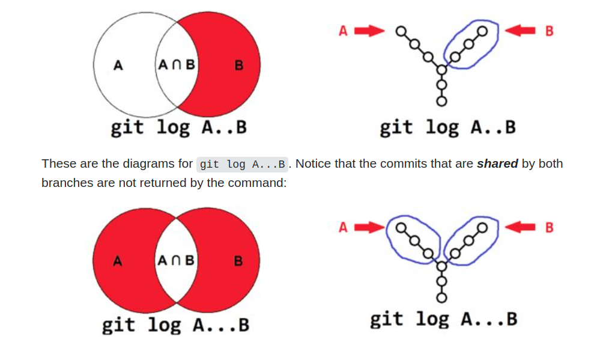
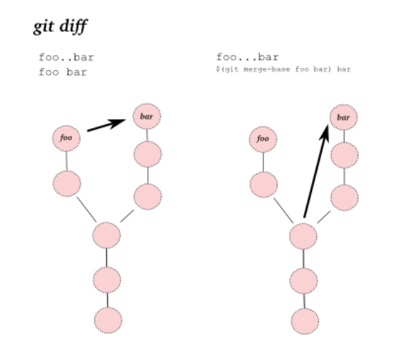

# My-Git-Notes

1) Software Development is a continuous process

2) We are required to get snapshots of our software

3) Why do we use Git?

- To follow development processes

- To collaborate

- Enabling us to split our project into particular branches

4) Illustration of Working Directory, Staging Area, Local Repository, Remote Repository


5) To see the properties of git configuration
```shellscript
git config --list
```
6) To set a name to configuration name
```shellscript
git config --global user.name "Muhammed Buyukkinaci"
```
7) To set an email to configuration email
```shellscript
git config --global user.email 'your_email_address@gmail.com'
```
8) To create a local repo
```shellscript
git init
```
9) To get information about files and changes
```shellscript
git status
```
10) To transfer all FILES to staging area
```shellscript
git add .
```
11) To transfer staged changes to The local repository
```shellscript
git commit -m "Transfering to the local repository"
```
12) An VSCode extension named as Live Server can be used in HTML

13) To send all CHANGES to Staging Area
```shellscript
git add -A
```
14) After renaming a file, add all files to The Local Repository
```shellscript
git add .
```
15) To see short version of changes:
```shellscript
git status -s
```

16) While committing, messages can be copies of the results of 'git status'


17) To roll back a change from Staging Area:
```shellscript
git restore --staged filename
```
18) To roll back a change from Working Directory
```shellscript
git restore filename
```
19) To see latest commit
```shellscript
git show
```
20) To see all commits in The Local Repository
```shellscript
git log
```
21) To see summary of commits
```shellscript
# A classical git log oneline
git log --oneline
# Detailed version
git log --oneline --decorate --graph

```
22) To see only latest 2 commits
```shellscript
git log -p -2
```
23) To see commits after a time period
```shellscript
git log --since=10minutes
```
24) To go back to a specific commit
```shellscript
git checkout 7_DIGIT
```
25) To go forward to latest commit
```shellscript
git checkout master
```

26) Checkout can be used to go back to previous versions.


27) To delete a commit and its effects
```shellscript
git revert 7_DIGIT
```
28) To revert a change of revert
```shellscript
git revert 7_DIGIT
```

29) While using ```git reset```, take care a lot. To remove staged files from Staging Area(Not Working Directory)
```shellscript
git reset FILE_NAME
```
30) To roll back from only The Local Repository
```shellscript
git reset --soft HASH_NUMBER
```
31) To roll back from Staging Area and The Local Repository
```shellscript
git reset --mixed HASH_NUMBER
```
32) To roll back from  Working Directory, Staging Area and The Local Repository
```shellscript
git reset --hard HASH_NUMBER
```
33) Put the names of files that you don't want to be tracked into .gitignore file. A sample .gitignore file was listed below.
```
log.txt
directory/
*.py
```
34) Create .gitignore firstly while creating a project. If you didn't do this, clear cache by command below.
```shellscript
git rm -r --cached .
```


35) To create a new branch
```shellscript
git branch branch_name1
```
36) To list all branches in a project
```shellscript
git branch -a
```
37) To pass to a different branch
```shellscript
git checkout branch_name1
```
38) To pass back to master branch
```shellscript
git checkout master
```
39) While on master, merge different branches into master.
```shellscript
git merge branch_name1 branch_name2
```
40) To clone a Remote Repository to The Local Repository. While cloning, a default .git directory is created.
```shellscript
git clone REMOTE_REPO_URL

git clone REMOTE_REPO_URL new_folder_name
```
41) To show which files to be removed from working directory
```shellscript
git clean -n
```
42) To clean out which files to be removed from working directory
```shellscript
git clean -f
```
43) Rebase the current branch onto base. base can be a commit ID,branch name, a tag, or a relative reference to HEAD.
```shellscript
git rebase <base>
```
44) To add a new remote to local repo
```shellscript
git remote add origin https://github.com/user/repo.git
```
45) To fetch a specific branch from the remote. Leave off branch to fetch all remote refs. It allows only copying, not merging
```shellscript
git fetch <remote> <branch>
```
46) To fetch the specified remote’s copy of current branch and immediately merge it into the local copy. git pull = git fetch + git merge
```shellscript
git pull <remote>
```
47)To push the branch to remote, along with necessary commits and objects. Creates named branch in the remote repo if it doesn’t exist.
```shellscript
git push
<remote> <branch>
```
48) To Reset staging area to match most recent commit, but leave the working directory unchanged.
```shellscript
git reset
```
49) Reset staging area and working directory to match most recent commit and overwrites all changes in the working directory.
```shellscript
git reset --hard
```
50) Reset staging area and working directory to match most recent commit and overwrites all changes in the working directory.
```shellscript
git reset <commit>
```
51) Reset staging area and working directory to match most recent commit and overwrites all changes in the working directory.
```shellscript
git reset --hard <commit>
```
52) To Fetch the remote’s copy of current branch and rebases it into the local copy. Uses git rebase instead of merge to integrate the branches.
```shellscript
git pull --rebase <remote>
```
53) To Forces the git push even if it results in a non-fast-forward merge. Do not use the --force flag unless you’re absolutely sure you know what you’re doing.
```shellscript
git push <remote> --force
```
54) To push all of your local branches to the specified remote.
```shellscript
git push <remote> --all
```
55) Tags aren’t automatically pushed when you push a branch or use the --all flag. The --tags flag sends all of your local tags to the remote repo.
```shellscript
git push <remote> --tags
```
56) To Show difference between working directory and last commit.
```shellscript
git diff HEAD
```
57) To show difference between staged changes and last commit
```shellscript
git diff --cached
```

58) To delete a branch
```shellscript
git branch -d branch_name1
```

59) To add a new developer to the existing project on GitHub, Settings --> Manage Access --> Invite a collaborator

60) github.com/octocat/Spoon-Knife project can be used while forking a project. After forking a project and making changes, we should create a pull request. Our pull request is going to be evaluated by project owner or team leader.

61) We can use GitHub to host our static websites. Make a repository named as GITHUB_USER_NAME.github.io .

62) To show which repos are available on remote

```shellscript
git remote -v
```

# Sources

- https://www.youtube.com/watch?v=SX8bHqXt8ws
- https://www.atlassian.com/git/tutorials/atlassian-git-cheatsheet


63) How to git restore a particular extension

```
git checkout -- "*.xml"
```

64) How to add a new remote repository to a local repository

```shell
#origin is the name of a remote repository in local computer.
git remote add my_awesome_new_remote_repo git@github.com:MuhammedBuyukkinaci/My-Git-Notes.git
git remote add origin git@github.com:MuhammedBuyukkinaci/My-Git-Notes.git
```

65) To remove a remote repository from a local repository

```
git remote remove NAME_OF_REMOTE_REPO_IN_LOCAL
# Example:
git remote remove origin
```

# Git For Professionals

[Video link](https://www.youtube.com/watch?v=Uszj_k0DGsg)

### Perferct Commit

66) [git-tower.com](https://git-tower.com) is a GUI to improve git facilities.

67) Git staging area is enabling us to make 2 different commits from a single file

```file1.py

import os # go to commit 1

import sys # go to commit 2

```

68) Changes in a topic should belong to a single topic/issue.

69) `git add -p index.html` is  chooging parts of a file to a commit, not a whole file. We are prompted to choose which parts to be committed thanks to `-p` flag.

70) `git commit` has a subject and a body section. After putting changes to a staging area, type `git commit` and a window is prompted. The first line is commit subject that shouldn't exceed 80 characters.The second line is empty. The third line is the detailed explanation

`
### Branches

71) 3 types of branches:
 
- Mainline branches like main or master, long living
- Integration branches like develop or staging, long living
- Feature branches (refactoring, experiment, bugfix, release etc.), short running


72) If you have staging, development, production environments, it is advised to mirror branches (main, develop etc.)

73) Commits shouldn't be directly merged/rebased to integration and mainline branches. They should be committed on feature branches.

74) Short lived branches are created for certain purposes like bugfix or refactoring or experiments or feature adding.

75) Githubflow is advocating a simple approach. 1 long running branch + feature branches(feature, bugfix, refactoring).


76) Gitflow is a more structured approach.

- main: current production code
- develop: feature branches start from develop branches and merged back on develop branch
- feature: new attributes or bugfixes or refactoring are coded on feature branches.


77) A tag named release should be added to release branches

### Pull Requests

78) Pull Request is a feature of git hosting platforms (github, bitbucket, gitlab)

79) Pull Request invites others(reviewers) to give feedback before merging changes in code.

80) Pull Request is enabling us to improve an open source project on a hosting platform like github. This happens in the following way:

Fork      --> Change (Improve) the forked repo --> Open a pull request to original repo from new
the repo      on a new branch                      branch of forked repo to master branch of original repo

81) Pull Requests are always based on branches not on individual commits.


### Merge Conflicts

82) `git merge`, `git rebase`, `git pull`, `git cherry-pick`, `git stash apply`, all of these may result to a merge conflict.

83) Merging branches works effortlessly in most of the times because git is usually able to figure out what is going on.

84) Contradictory changes like `same line changed by 2 different branches, a file modified on 1 branch and deleted in other etc.` may result in merge conflicts.

85) You can't ignore merge conflict. You have to deal with before you can continue your work. Dealing with a merge conflict doesn't mean you have to resolve it; you can undo it and this is sometimes really helpful.

```
git merge --abort

git rebase --abort
```

86) git is marking the promlematic ares via *>>>>>* or *<<<<<<<*. *======* is separating changes of different commits


87) The solution to merge conflicts is to clean up the file. GUI options like git-tower and Github Desktop are really helpful on solving merge conflicts. On the other hand, there are dedicated merge tools. For complicated conflicts,it is great to have  dedicated merge tool at hand. A merge conflict tool can be configured via `git config`.

88) After dealing with merge conflict via GUI or manually or git merge tool, We have to commit this situation like any other ordinary change.

### Merge vs Rebase

89) The simple scenario for merge is a fast-forward merge.


90) Normally, a commit is created by a human being. It is made after related changes. However, a merge commit is a little bit different. It isn't created by developers, it is created by git gui automatically. Its purpose is to connect two branches, just like a knot.


91) Rebase isn't better or worse than merge. Rebase makes the project history to look like a straight line without any sign that it had been split into multiple branches at some point.

92) An example usage of git rebase and what is going on behind the scenes are below.

```
git rebase branch_Name_to_integrate
```


93) Rebase rewrites commit history.
<<<<<<< HEAD

94) Rebase should be used for cleaning up the local commit history. Don't use it on a remote repo.

# Advanced Git Tutorial

[Video link](https://www.youtube.com/watch?v=qsTthZi23VE)

### Interactive Rebase

95) Interactive Rebase allows us to manipulate commit history. Manipulate means change message, delete commit, reorder commits, combine multiple commits, edit on existing commis, split an existing commit into multiple commits. It is a swiss army knife which has several options together. However, it is a knife and be careful while using it.

96) Don't use interactive rebase on commits that were published on a remote repository. Interactive rebase should be used in cleaning up local commit history before mergings it into a shared team branch.

97) An example usage is below(commits are in reverse order, be careful):

```
git rebase -i HEAD~3
```

98) If the latest commit was required to be changed, use `git commit --amend`. For the other previous commits, use interactive rebase. Don't change of commit history of things that you already pushed into a remote repository. When *--amend * comment is used, it creates a new commit hash (7_DIGIT).

```
# To change commit message of latest commit
git commit --amend -m "new commit message"
```

99) First enter `git rebase -i HEAD~3`. It will prompt a new window asking that what kind of change (keyword) I want to make. Replace **pick** with **reword**. A new prompt will pop up. Rewrite commit message and see changes.

99.5) **drop** is the action keyword to delete the commit.

100) Squash is combining 2 commits by creating a new commit

```
git rebase -i HEAD~4

# To combine 7_DIGIT_3 & 7_DIGIT_4, write squash before 7_DIGIT_3. It will merge 7_DIGIT_3 and its previous commit(7_DIGIT_4)

# pick 7_DIGIT_4                     pick 7_DIGIT_4
# pick 7_DIGIT_3       ------>       squash 7_DIGIT_3
# pick 7_DIGIT_2       ------>       pick 7_DIGIT_2
# pick 7_DIGIT_1                     pick 7_DIGIT_1
```

```
# To add a new file to a previous commit

git add filename

git commit --fixup 7_DIGIT_PREVIOUS_HASH

# fixup keyword combines the line above like squash
git rebase -i HEAD~4 --autosquash

```

```
# Split an existing command
```

100.5) Don't use interactive rebase for latest commit manipulation. Use it for more previous commands(HEAD~3 etc.).

### Cherry Picking

101) cherry-pick allows us to pick individual commits to be integrated. It is on the level of commit, not on branches.

102) The main integration level should be branch level. `git merge` and `git rebase` do what we want in most cases. Cherry picking isn't a replacement of git merge and git rebase.

103) Committing on a master branch directly is a practical use case for cherry picking. I n this case, it is necessary to move commit from master branch to feature branch.

104) A commit is made intp master wrongly. We want to move it into feature branch.

```
git checkout feature branch

git cherry-pick 7_DIGIT

git checkout master

# delete wrong commit from master
git reset --hard HEAD~1

git reset --hard 7_DIGIT
```

### Reflog

105) Reflog can be regarded as git's diary. It is a perfect choice if things go wrong.

106) For instance, we deleted 2 recent commits via `git reset --hard` wrongly. However, we noticed this is a bad idea. Reflog comes in play in this situation. We wat to get back to the situation before 2 commits were deleted.

```
git reflog

git reset 7_DIGIT_ON_REFLOG
```

107) To start a new branch from a particular commit

git branch NEW_BRANCH 7_DIGIT

108) Reflog comes in handy when a branch is deleted wrongly.

```
git reflog
# find commit hash
git branch NEW_BRANCH 7_DIGIT
```

### Submodules

109) A submodule is a standard git repository. The ony speciality is that it is nested inside a parent repository.

110) Submodule property of git comes in handy especially if we want to include a 3rd party library or something like that. To use submodule of git, create a folder in the main repo and this is submodule.

```
mkdir lib
cd lib
git submodule add REMOTE_URL_OF_REPO
```

111) The actual content of submodule isn't stored in our parent repo.

112) After creating a submodule, a *.gitmodule* file is created in parent repo directly. It is also added to .git/config file.

113) git also stores a copy of submodules under .git/modules.

114) It is recommended to use Git GUI's like tower and Github Desktop if you are dealing with git submodules.

115) Git regards adding a submodule as a modification and that change ought to be committed.

116) When a repo is cloned from Github, it only has configurations of its submodules, not the content of its submodules. If you want to download submodule contents of repo, run the following after cloning.

```
git clone URL_OF_REPO
git submodule update --init --recursive

# or directly
git clone --recursive-submodules URL_OF_REPO
```

117) Submodule repositories are always checked out on specific commits , not a branch. Content of a branch can change over time when near commits arrive. For submodule, we always want a specific version which was checked out.

### Search & Find

118) We can filter commit history by date, message, author, file, branch.

```
git log --after="2021-7-1" --before="2021-7-5"

git log --grep="refactor"

git log --author="Muhammed"

# Not to confuse filename with branch name
git log -- README.md

# To show commits in master and not in feature/login

git log feature/login..master

# To show commits in local master and not in remote master

git log origin/master..master
```

119) grep can use regular expressions. Therefore, there is no limit to our creativity while filtering commits.

# Git and Github For Beginners

[Video Link](https://www.youtube.com/watch?v=RGOj5yH7evk)

120) An tutorial for setting up ssh keys is [SSH keys](https://docs.github.com/en/authentication/connecting-to-github-with-ssh/generating-a-new-ssh-key-and-adding-it-to-the-ssh-agent)


121) -u flag in git push is used to set upstream. After setting the upstream via `git push -u origin master`, we don't have to type `git push origin master`. `git push` is enough.

122) To show differences between a master and feature branch

```
git checkout master
git diff FEATURE_BRANCH_NAME
```

123) It is recommended to create a PR (pull request) and let other developers review it rather than merging feature branch on top of master. After pull request is approved, pull changes via `git pull`

124) To create a branch and switch to that branch, there are 2 ways to do this:

```
# 1)
git branch feature_branch
git checkout feature_branch
# 2)
git checkout -b feature_branch

```

125) stashing is a way to stash your changes somewhere and you can retrieve them later. It isn't making any commits. It is a temporary placeholder for changes. `git stash` is useful especially if you don't want to lose your code and you want to switch between branches.

```
# Store changes in stashing
git stash
# Revert changes after switching between branches
git stash apply
```

126) HEAD is a pointer to last commit. HEAD is the currently active or checked out branch.

127) To unstage a file from staging area

```
git reset filename.py
```

128) To undo latest commit

```
git reset HEAD~1
```

129) To get rid of all of the changes after a certain point (C1-C2-C3-C4) (C4 is head and we want to move back to C2). HEAD is now pointing to HASH_ID.

```
git reset --hard HASH_ID_OF_C2
```

# How to Undo Mistakes With Git Using the Command Line

[Video Link](https://www.youtube.com/watch?v=lX9hsdsAeTk)

130) To restore some chunks of a file which is staged(it will prompt up question about hwether to discard or not)

```
git restore -p filename
```

131) To revert a commit which is in the middle (C1 - C2 - C3 - C4) (in this case it is C2), which means invalidating its effects

```
git revert HASH_OF_UNWANTED_COMMIT
```

132) For `git reset`, **--hard** and **--mixed** are most frequently used options. If you want to have a clean working directory, **--hard** is handy. **--mixed** is moving back a previous commit but it has undone changes in the working directory.

```
# Hard reset, cleans latest commits and latest commits disappear
git reset --hard 7_DIGIT
# To Roll back to one previous commit
git reset --hard HEAD~1

# Mixed reset, cleans latest commits latest commits appear in working directories as unstaged.
git reset --mixed 7_DIGIT
```

133) To revert a file to a previous version in a previous commit

```
git restore --source 7_DIGIT filename
```

# Branches

[Video Link](https://www.youtube.com/watch?v=e2IbNHi4uCI)

134) `git switch BRANCH_NAME` is an alternative to `git checkout BRANCH_NAME` in order to switch between branches.

135) To rename a branch(while checked out the branch, which is HEAD)

```
git branch -m NEW_BRANCH_NAME
```

136) To rename a branch which isn't checked out(non HEAD)

```
git branch -m PREVIOUS_BRANCH_NAME NEW_BRANCH_NAME
```

137) Renaming a remote branch isn't possible. Instead, delete the former branch from remote and push the newly renamed branch to remote repo.

```
# Delete the old branch from remote
git push origin --delete OLD_BRANCH_NAME

git push -u origin NEW_BRANCH_NAME
```

138) Tracking connection is used to be able to use `git pull` or `git push` directly. To establish a tracking connection

```
git branch --track LOCAL_BRANCH_NAME REMOTE_BRANCH_NAME
# or
git checkout --track REMOTE_BRANCH_NAME

```

139) Tracking connection is useful in whether to notice remote and local branches diverge or not.

140) To delete a branch from remote

```
git push origin --delete BRANCH_BAME_TO_DELETE_ON_REMOTE
```

# Others

141) Git may not recognizes changes in file names. For instance, if we renamed a file from File01.py to file01.py, git may not detect the change in uppercase/lowercase. In this case, changing it to file_01.py is going to be detected.

142) In order to prevent git commands from behaving like less or cat commands, no pager can be useful.

```runall.sh
# git branch
git config --global pager.branch false
# git log
git config --global pager.log false
```

143) To change editor option to vim instead of nano in git

```run.sh
git config --global core.editor "vim"
```

144) Let's assume we are working on a feature branch based on master and remote master has changed. We should always make `git pull` operation and resolve merge conflicts before pushing into remote.

145) Git log 2 dots .. and 3 dots difference



146) Git diff 2 dots .. and 3 dots difference



147) Git tag is a pointer to a particular commit. It is permanent. They shouldn't be modified. There are 2 types of git tag. Lightweight and Heavyweight. It is used in releases. Lightweight tag is preferrable. Heavyweight tag is containing both tag message and commit message.

```run.sh
## Lightweight  Tag
# To assign a tag to current commit
git tag TAG_TO_ASSIGN

# To assign a tag to a previous commit
git tag TAG_TO_ASSIGN 7_DIGIT

## Heavyweight Tag
git tag TAG_TO_ASSIGN 7_DIGIT -m "message"


```


